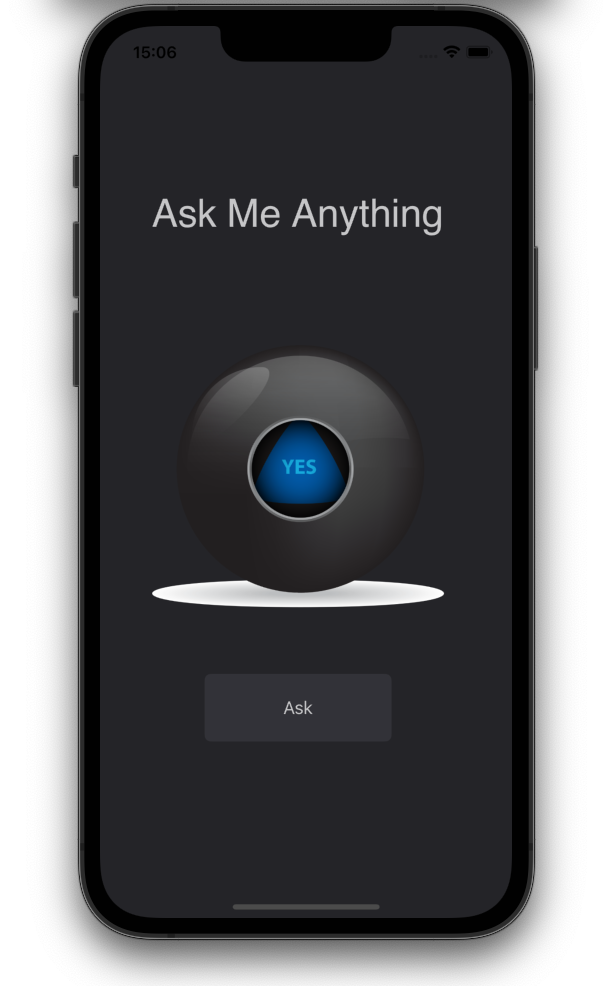

## Our Goal

The objective of this challenge is to apply the skills and get an app with functionality all by yourself. There’s no new concepts here.

## What we did

A Magic 8 Ball app. You can ask the app to make all your hard decisions! With this app in your pocket, you’ll always have an answer to life’s many conundrums!

> This is a project made from The App Brewery's Complete App Developement Bootcamp, check out at [www.appbrewery.co](https://www.appbrewery.co/)
